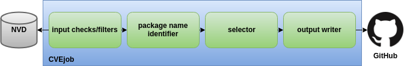

# How it works

The diagram above shows how CVEjob works under the hood.

CVEjob can process any [NVD data feed](https://nvd.nist.gov/vuln/data-feeds#JSON_FEED). In default configuration, "CVE-Modified" feed is used. The feed contains CVEs which were added or modified in last 8 days.

## The pipeline

CVEjob is a pipeline and CVEs from given NVD data feed are processed one-by-one.

Pipeline steps:

* **input checks/filters**: initial set of checks which can filter out CVEs which don't belong to any of the supported ecosystem.

* **package name identifier**: step which tries to identify names of packages which might be affected by given CVE. The output can be up to 10 package name candidates.

* **selector**: step which performs additional checks on package name candidates identified in previous step and tries to narrow down the selection to a single winner.

* **output writer**: currently the only way how to report results is to open pull requests in our [GitHub CVE database](https://github.com/fabric8-analytics/cvedb/), where the results can be reviewed.
