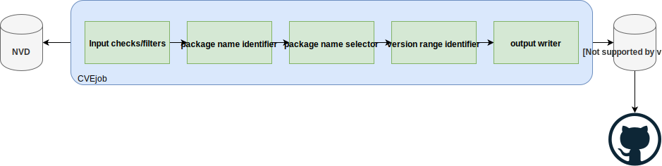

# How it works

The diagram above shows how CVEjob works under the hood.

It's basically a simple pipeline. It always starts with a CVE from NVD and ends with CVEjob YAML file
stored in the local database. Or it ends without any YAML file if given CVE was not identified by CVEjob
as affecting a package from one of the supported ecosystem.

When deployed as an OpenShift cronjob, CVEjob periodically (once a day) checks what's new in the [CVE-Modified NVD feed](https://nvd.nist.gov/vuln/data-feeds#JSON_FEED)
and then opens pull requests in [fabric8-analytic/cvedb GitHub repository](https://github.com/fabric8-analytics/cvedb/).

## The pipeline

CVEjob is a pipeline and CVEs from given NVD data feed are processed one-by-one.

Pipeline steps:

* **input checks/filters**: initial set of checks which can filter out CVEs which don't belong to any of the supported ecosystem.
Note it may happen that, in some cases, the checks will filter out even valid CVEs.
The primary purpose of this step is to reduce the number of false positives, i.e. CVEs incorrectly associated with supported ecosystems.
Only CVEs which satisfy following conditions will be processed by the rest of the pipeline:

  * given CVE is no older that specified "age" (age=1 means that CVE must be have been added or modified in the last day).
  * given CVE has been analyzed by NVD - CVEs in NVD can be in "awaiting analysis" state,
  i.e. they can be later accepted or rejected by NVD. CVEs that haven't been analyzed yet lack information
  like for example associated CPE names or affected version ranges.
  CVEjob only translates data from NVD to a different format (and tries to map CVEs to proper package name),
  nothing more. Therefore CVEs need to be analyzed by NVD first.
  * additional input checks don't filter out given CVE based on description or references.

* **package name identifier**: step which tries to identify names of packages which might be affected by given CVE.
The output is up to 10 package name candidates. The candidates will be further evaluated in following steps.

* **selector**: step which performs additional checks on package name candidates identified in the previous step
and tries to narrow down the selection to a single package name.

* **version range identifier**: this step translates information about affected and unaffected versions from NVD to CVEjob YAML file.

* **output writer**: this step takes the input CVE from NVD, package name identified by CVEjob, and version ranges,
and it creates a YAML file in the local database (`database/` directory).

The pipeline doesn't directly open pull requests in [fabric8-analytic/cvedb GitHub repository](https://github.com/fabric8-analytics/cvedb/).
There is a script called `open_pull_requests.sh` for that purpose. It can be used independently.
Typically, CVEjob will be run on CVEs from NVD and then the script will be called. When running CVEjob locally,
it is possible to curate results (modify resulting YAML files) before opening pull requests.
