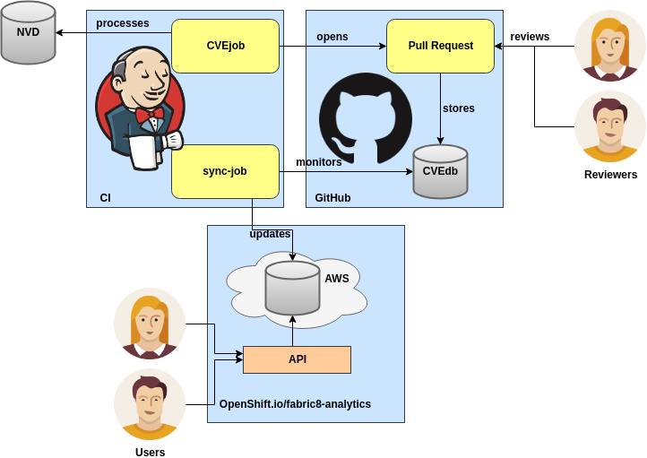

# CVEjob in fabric8-analytics

The diagram above shows the flow of CVE data from [National Vulnerability Database](https://nvd.nist.gov/) (NVD) to the database maintained by fabric8-analytics project.

NVD doesn't map CVEs to package names as we know them from Maven, PyPI, NPM, and other repositories. CVEjob tries to map CVEs to proper package names. Since the mapping is not straightforward, the results of CVEjob need to be reviewed before mapped CVEs can be added to the database. The long-term goal is to minimize, or completely eliminate the need for reviews.

Once mapping is reviewed and approved, it lands in our [GitHub CVE database](https://github.com/fabric8-analytics/cvedb/). From there, it gets synced to the database used by fabric8-analytics project.

fabric8-analytics provides an API which can be used by end users to easily query the database for known vulnerabilities.

Currently supported language ecosystems are [Maven](http://central.maven.org/maven2/), [PyPI](https://pypi.org/) and [NPM](https://www.npmjs.com/). Note Maven support is still lacking behind and thus reviews are more time-consuming.
